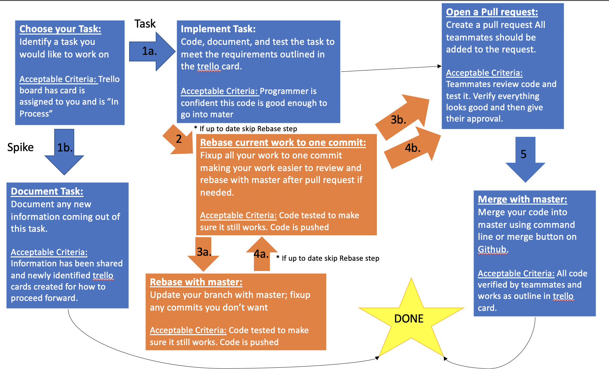

# Our Development Process:


## **Branches Notes**
To create a feature branch for your task and name it what your task is `git checkout -b <your-branch-name>`. You should be on your new branch. To go back to master or other branches in origin run the command `git checkout <branch-name>`. 

Now you are ready to do your work in your current branch. Make the changes you need to make and when every you want to commit your changes. **Remember your work is always local and not in GitHub until you push.**

### **Managing your Branches**
Explanation of our branching policy and how to create/check out branches.

1. 2 tiers of branches:
* Master is all code that has been completed, reviewed and merged with other developed code
* Issue branches are where you are actively developing your task - matched to a given trello board task
2. Multiple tasks can be done in the same branch, but they should be subtasks of a story and the branch should be named something around that story

3. `git status` - returns all your current work from your last commit. Shows if you have staged files or unstaged files.

4. `git branch` - lists all branches that have been checked out on this repo

5. `git checkout <branch-name>` - checks out the branch name given

6. `git branch <name>` - Create a branch with a name of `<name>`

7. The current branch you have checked out is the parent of any newly created branch. Create all issue branches from master

8. `git checkout -b <branch-name>` - Creates and checks out a new branch with name branch-name

9. Local branches must be pushed to remote repository before they can be seen on github

10. Create branch remotely through github website - must use git pull to see new branch locally

### **Updating Your Repository with Code Changes**

1. A commit is a collection of changes you want to make a revision point for

2. All commits should be stable - everything should compile and everything should be functional

3. `git add .` - stages all files for commit.

4. `git add` can be called on a single file or a directory running `git status` will show you how. Additionally, you can using the `*` to indicate a wild card. For instance `git add someFolder/*` will add everything in ***someFolder***

5. `git status` - Shows a list of changes done on the branch since the last commit

6. `git diff` - Shows all changes that have been done since the last time you added things

7. All changes after an add must be added again to stage them

8. `git commit` - commits all changes that have been staged as a single revision. Try to always include the -m flag to put a commit message. I.E. `git commit -m "a message indicating what changed"`

9. Commit messages should always have meaningful message to describe the changes

10. `git log` - Shows the commit history and the individual commit SHA's.

11. `git push origin <branch-name>` - pushes all new commits on the local branch to the remote branch


## **Rebase Notes:**
This section will define how a rebase works, reasons why you might rebase your current changes down to one, and how to do a rebase.

### **How a Rebase Works:**

1.	After completing a Pull Request but before merging changes to master, you might want to rebase your changes to include the changes made to master since you started coding in you own branch.

2.	Branches contain all commits of their parent when they are created - these are referred to as the base.

3.	Merging is very simple when the commits in your base are the same as the commits that are in your parent

4.	A rebase is the process of taking your base and replacing it with another base.

5.	`git rebase origin/master -i` : Replaces your base with the current code in master and your work on top of that.
**NOTE**: The -i inside of the call means interactive 

6.	If there are conflicts between changes in master and changes in your code, the rebase will stop and ask you to re-write the conflicting commit


More information can be found: https://github.com/Junjie-Chen/git-rebase

### **Addition help rebasing:**

You can rebase your current work before starting a merge or rebasing with another branch (I.E. master). What this will do is take all your current work and put it into one commit; having one SHA, one git hash.

To do this use the follow command **(before doing this read the how to do a rebase to understand why you would want to do this)**:

1.	`git rebase -i HEAD~#`: rebases your top level commits with the provided number (#) of commits.

The good thing about this command is that it almost never has merge conflicts because it is working with the commits you have created.

An example of when to use this would be [Jamie's PR](https://github.com/Trek5200/water_garden_tour/pull/2). She had 3 commit:

She would have ran the command `git rebase -i HEAD~3`

Vim would show up and we would see something like (not in a nice table =))
| comments      | git hash or SHA  |
| ------------- |:-------------:|
| Add files via upload copy and paste ....| 992f364 |
| Add files via upload | 5d3d612 |
| zebra stripes | cb9ff8e      |

She would *pick* the top most commit. *fixup* the other two commits. then hit `esc` and type `:wq!` in vim and BOOM done all here changes are now in one commit and have a new git hash.

Why this is important is because now you are rebasing only 1 change and not the 3. So if you were to have a merge conflict then you would only have to change it 1 time and not the possibility of 3 times *(one fore each commit)*.


### **Running a Rebase:**
If at any time you want to stop the rebase and start over you can run the command `git rebase --abort` this will put you at the state you were in before you started the rebase. It will act as if it never happened.

1.	Before running rebase - `git checkout master`. Then run the command `git pull`. This updates your local repository with the current remote/origin master branch

2.	Run rebase command `git rebase origin/master -i`

3.	Rebasing opens a text file, called VIM, which contains the SHA (git hash) and the commit message of each commit contained within the branch. 

The available commands that are open to use are shown at the bottom of the text file.
*	***Pick*** is chosen by default. It means use this commit in the rebase
*	***Reword*** allows you to use the commit, but you want to edit the commit message
*	***Squash*** will append a commit to the commit before it and concatenate the commit message
*	***Fixup*** is the same as squash, however it does not append the commit message
*	***Drop*** will remove a commit - do not use unless you mean it
* **99% of the time we want to pick all**

By default all the commits will be *pick* if you are happy with that then hit `esc` to stop typing and then type `:wq!` on the command line to write (w) and quit (q) vim. OTHERWISE, we will choose our options hit `i` for insert and then move with your arrow keys. Choose from the avalible commands based on what you are trying to do by deleting *pick* and replacing it with the specific command you want.  

**If you do not wish to save and close:** type `:q!` if the rebase still starts then run the command `git rebase --abort` to stop the process.

6.	If your rebase fails, you will see something like: `(CONFLICT) someRandomFilePath`, run `git status` to see the conflicted files they will be in the red.

7.	The conflict will show you their changes, followed by a line of ===, signs and followed by your changes. It will look something like:
```
<<< HEAD
what you are rebasing to changes
===
Your changes 
>>>
```

8.	Resolve conflicts by making the file look like it's supposed to, you might want to pick a few changes from both, theirs and yours. Do not just accept one or the other unless you're sure.

9.	After you fix the file, use `git add .` or `git add someFile` to stage the file(s) to let git know you have resolved the conflict.

10.	Once all files have been resolved and staged, run `git rebase --continue` to continue your rebase. Remember if you are not happy with the result or changes run `git reabse --abort` to stop the merge.

11.	Remember to test your code during the rebase to make sure that the changes are correct!

12.	Rebases are done locally, not on remote/origin. So you must push your changes after completing your rebase and if anything breaks you don’t break the overall app.

13.	Use `git push origin yourBranchName` this should fail because you rewrote history (changed your base) so you have to do what's called a force push, `git push origin yourBranchName --force` this tells git to overwrite your remote/origin commit history with your local history

14.	Try to never use the force flag unless you're doing it on purpose and for a rebase or any other time you rewrite history (your base)!


## **Pull Request Notes:**

This section will define how to create a pull request and merge in on the command line.

### **Creating a Pull Request**
How to create a pull request and merge code into master

1. Just because git did not find any conflicts with your changes does not mean there are no conflicts

1. The pull request is how you and your teammates will verify that there were not any conflicts with your workflow and any workflows they added

1. Use the Pull Request link on your branch on github to create a pull request.

1. The title should be a short description of your task.

1. It might be helpful to add links and explain your changes here. Maybe link to the trello card so team members can understand the task.

1. If you receive comments on the pull request, you can update your branch by adding new commits and the pull request will automatically update with the new commits.

1. Once you have received approval from all of your teammates on the pull request, you can merge your code into master.

### **Merging your Branch**
How to merge your code into master after it has been coded, reviewed, rebased and gone through a pull request.

1. There is a pretty green button that says Merge Pull Request on your Pull Request (note you can probably get away with hitting the button) BUT the rest of this covers how to Merge on command line.

1. Make sure your code is rebased properly before merging your code. If necessary (your base is not equal to master base), rebase your code again to master

1. To merge your code, run `git checkout master` then run `git merge <branch-name>` This checks out master and merges your branch into master.

1. After your code is merged, you probably should test to make sure it works. Remember you MUST PUSH your merge to master by running `git push origin master`. The green button does not allow for testing. This is why the command line is safer than the green button.

1. After you push your code to master, you might receive an email stating that you have merged your pull request. But either way github has automatically closed the Pull Request for you.

1. After your code is merged, you can move your trello card to done!
